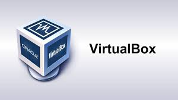
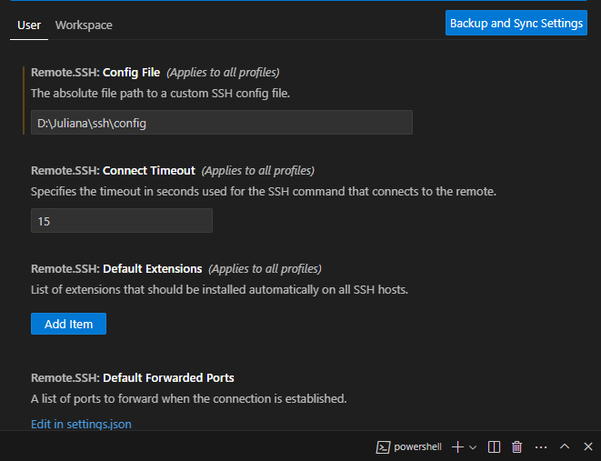

# Preparação de ambiente
### Vamos preparar o ambiente para desenvolvimento de aplicações

#### Nesta ambiente iremos instalar e configurar os seguintes recursos:
- Máquina virtual (virtual box)
- Distribuição linux (ubuntu server)
- Nasm 
- Copilador da linguagem C
- Configurar o ip e a porta de comunicação entre a máquina real e a virtual
- Configurar o acesso via ssh entre o Vscode e o servidor linux
- Instalar as extensões: Material Icon, Nasm, SSH e Linguagem C/C++

#### Máquina Virtual (Virtualbox)

Máquina virtual é uma ferramenta que permite a criação de novos "computadores" e a instalação de sistemas operacionais, para estudo ou trabalho.

Para o nosso estudo iremos usar o Virtualbox da Oracle.
Para instalar basta fazer o download no link a seguir:

<a href="https://www.virtualbox.org/wiki/Downloads" target="-blank">Virtualbox </a>

##### Criando a Máquina virtual para o nosso estudo

- Configuração:
 > - Nome da máquina: Servidor
 > - Memória: 4gb(4096)
 > - Processador: 2
 > - Disco: 100GB 
 > - IP e Porta do Host: 127.0.0.1 e 22
 > - IP e Porta do Convidado: 10.0.2.15 e 22

 - Tela inicial de configuração
 

 - Tela configuração do Hardware
 

 - Tela de configuração do disco
 

 - Tela final de configuração 
 

 - Tela inicial de configuração de rede
 

 - Tela de configuração de Portas e IP
 

 #### Distribuição Ubuntu Server
  Para o nosso estudo iremos utilizar uma distribuição Linux para servidores chamada Ubuntu.
  Acompanhe o processo de instalação
  Faça o download aqui:
  <a href="https://ubuntu.com/download/server" target="_blank"> Ubuntu Server </a>

  

  - Acompanhe a instalação

- Tela de Início de instalação
  

- Tela de seleção de Idioma
   

- Tela de seleção de teclado
    

- Tela de tipo de instalação

- Tela configuração de rede
   

 - Tela configuração de proxy
  

 - Tela pacotes de atualização
 

 - Tela configuração do disco
 

- Tela layout do disco
 

 - Tela configuração do usuário
 

 - Tela configuração o ssh
 

 - Tela do fim da instalação
 

#### Instalação do compilador NASM
O compilador NASM é uma ferramenta que nos permite programar 
em Assembly. Assim é possível criar programas que manipulam
dados que estão nos registradores de processador.

Para instalar o NASM no Ubuntu, usamos o comando:
...
sudo apt install nasm -y
...

#### Instalação do compilador da linguagem C

Em linux, o compilador da Linguagem C é o GCC. Ele é uma
ferramenta importante para o desenvolvimento de programas
em C.

Para instalar use o comando:
...
sudo apt install gcc -y
...

#### Conexão Servidor e VSCode via SSH
Precisamos instalar uma extensão no VSCode para acessar o nosso servidor de forma remota.

Configuração do acesso remoto.

